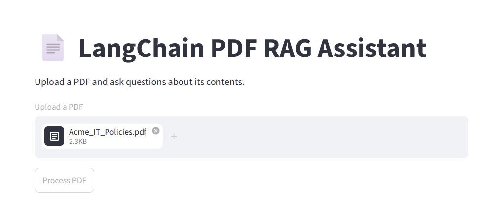

# 📄 LangChain PDF RAG Assistant

A Retrieval-Augmented Generation (RAG) application that allows users to upload a PDF document and ask natural language questions about its contents.

The application uses LangChain to automate the RAG pipeline, including document loading, text chunking, embedding generation, vector search with FAISS, and answer generation using a local Ollama LLM.

## Tech Stack

- Python
- Streamlit
- LangChain
- PyPDFLoader
- RecursiveCharacterTextSplitter
- Sentence Transformers
- FAISS
- Ollama (Llama 3)
- HuggingFace Embeddings

## Architecture

```text
                 User Uploads PDF
                         │
                         ▼
                 PyPDFLoader
                         │
                         ▼
      RecursiveCharacterTextSplitter
                         │
                         ▼
          HuggingFace Embeddings
                         │
                         ▼
              FAISS Vector Store
                         │
         ───────────────────────────────
                         │
                  User Question
                         │
                         ▼
             Question Embedding
                         │
                         ▼
              FAISS Retriever
                         │
                         ▼
          Relevant Document Chunks
                         │
                         ▼
           Ollama (Llama 3 via LangChain)
                         │
                         ▼
                 Generated Answer
```

## ⚙️ Installation

Clone the repository

```bash
git clone https://github.com/jrupasinghe222-ux/langchain-pdf-rag.git
cd langchain-rag
```

Create a virtual environment

```bash
python -m venv .venv
```

Activate it

### Windows

```powershell
.venv\Scripts\activate
```

### macOS/Linux

```bash
source .venv/bin/activate
```

Install dependencies

```bash
pip install -r requirements.txt
```

## Ollama Setup

Install Ollama from:

https://ollama.com/

Download the model

```bash
ollama pull llama3
```

Verify the installation

```bash
ollama run llama3
```

---

## Running the Application

Start Ollama.

Then run

```bash
streamlit run app.py
```

Open the browser and:

- Upload a PDF
- Wait for processing
- Ask questions about the document

## Concepts Demonstrated

- Retrieval-Augmented Generation (RAG)
- LangChain
- PDF Processing
- Document Chunking
- Semantic Search
- Sentence Embeddings
- Vector Databases
- FAISS
- Prompt Chaining
- Local Large Language Models
- Streamlit

## Interface


